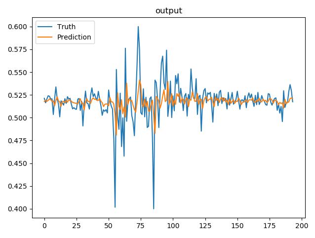
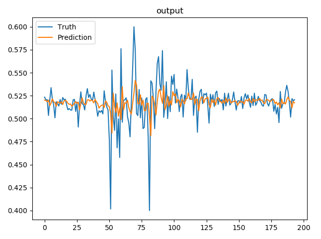

A New Transformer-Based Hybrid Model for Forecasting Crude Oil Returns
[Link to Paper](https://miscj.aut.ac.ir/article_4853_2aff1effea14f547578ddb40102ef681.pdf)


## Brent Oil Price Prediction

- Time series analysis with transformers
- Hybrid model

## Visualizing data


## Predicting the logarithmic return of prices instead of price it-self

### 1-Day ahead prediction using hybrid model on test set



### 5-Day ahead prediction using hybrid model on test set



## HOW TO CITE THIS ARTICLE

M. M. Abdollah Pour, E. Hajizadeh, P. Farineya, A New Transformer-Based Hybrid Model for
Forecasting Crude Oil Returns, AUT J. Model. Simul., 54(1) (2022) 19-30.
DOI: 10.22060/miscj.2022.20734.5263


Bibtex:
```
@article {
author = {Abdollah Pour, Mohammad Mahdi and Hajizadeh, Ehsan and Farineya, Parsa},
title = {A New Transformer-Based Hybrid Model for Forecasting Crude Oil Returns},
journal = {AUT Journal of Modeling and Simulation},
volume = {54},
number = {1},
pages = {19-30},
year  = {2022},
publisher = {Amirkabir University of Technology},
issn = {2588-2953}, 
eissn = {2588-2961}, 
doi = {10.22060/miscj.2022.20734.5263},
abstract = {In recent years, crude oil has been one of the most important energy sources in the world which impacts political stability and economic security in many countries. Furthermore, Crude oil price also has a huge influence on the world economic pattern due to being directly utilized in different industries in various ways. The purpose of this paper is to improve the ability of existing models in forecasting Brent crude oil returns. Hence, we propose two new deep learning-based models. The first model is based on the transformer which has been very popular in Natural Language Processing over the past few years. Moreover, different widely used deep learning-based methods of time series modeling such as SVR, MLP, GPR, and LSTM are implemented. The second model takes the outputs of all implemented methods as new features and feeds them to a Multilayer Perceptron network. The obtained results by each proposed model have been compared together concerning closeness to the real returns according to the predefined metrics. It is demonstrated that the new transformer-based model (the first model) has better results than the other four common machine learning-based methods. Consequently, the new hybrid model (the second model) provides better price forecasts among all implemented models.},
keywords = {Deep learning,Transformer,Forecasting,Brent oil returns,Hybrid Model},	
url = {https://miscj.aut.ac.ir/article_4853.html},
eprint = {https://miscj.aut.ac.ir/article_4853_2aff1effea14f547578ddb40102ef681.pdf}
}
```
